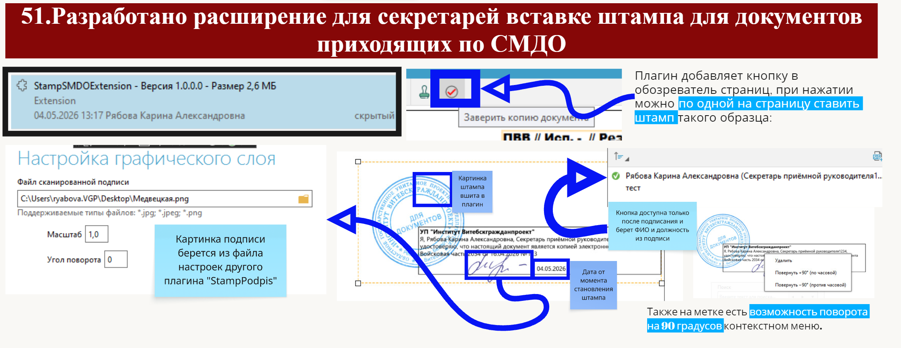

# SMDO Stamp Plugin (Secretary Stamp Tool)

## English

This plugin adds a stamp button to the page viewer interface.

When the button is clicked, a stamp can be placed on each page individually.

The stamp includes:
- signature image loaded from the settings file of another plugin ("StampPodpis")
- position and user data taken from the signer information
- date automatically set at the moment the stamp is applied
- embedded stamp image stored inside the plugin

The button becomes available only after the document has been signed. It retrieves the full name and position from the digital signature data.

Additionally, the stamp supports rotation by 90 degrees via the context menu.

---

## Русский

Данный плагин добавляет кнопку штампа в обозреватель страниц.

При нажатии на кнопку появляется возможность проставлять штамп по одной на каждую страницу.

Штамп включает в себя:
- изображение подписи, получаемое из файла настроек другого плагина **"StampPodpis"**
- должность и ФИО, получаемые из данных подписанта
- дату, устанавливаемую автоматически в момент проставления штампа
- изображение самого штампа, встроенное в плагин

Кнопка становится доступной только после подписания документа и использует данные ФИО и должности из электронной подписи.

Также на штампе доступна возможность поворота на 90 градусов через контекстное меню.

 
